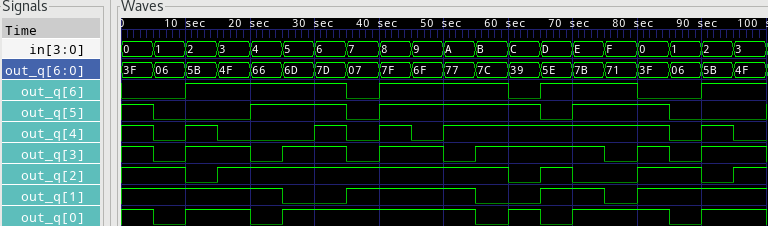

# 7 Segment Driver

```
  --a--
 |     |
 f     b
 |--g--|
 e     c
 |     |
  --d--

g = bit 6, a = bit 0;
```

Binary to 7 segment driver with output enable and 3 state outputs.

### Signals

* in - 4 bit input
* oe - Output enable
* out_q - 7 bit output to 7 segment

### Waveform

