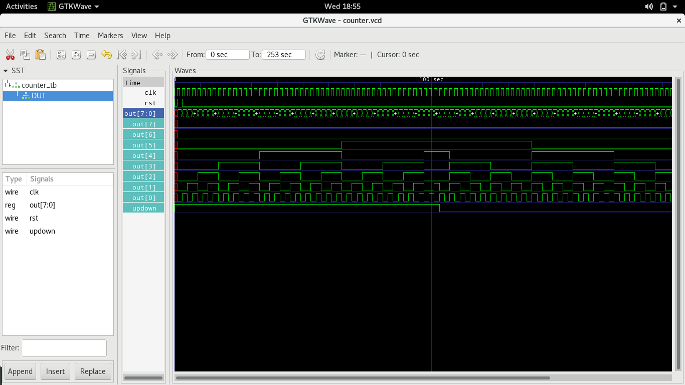

# Binary counter

Simple up/down binary counter, useful as a clock divider in powers of 2.

* clk - Input clk
* rst - Synchronous Reset
* updown - Active High Count Up signal
* out - Binary output

### Waveform

Notice each out pin will be at half the frequency of the previous pin halving the clock speed with a 50% duty cycle.

