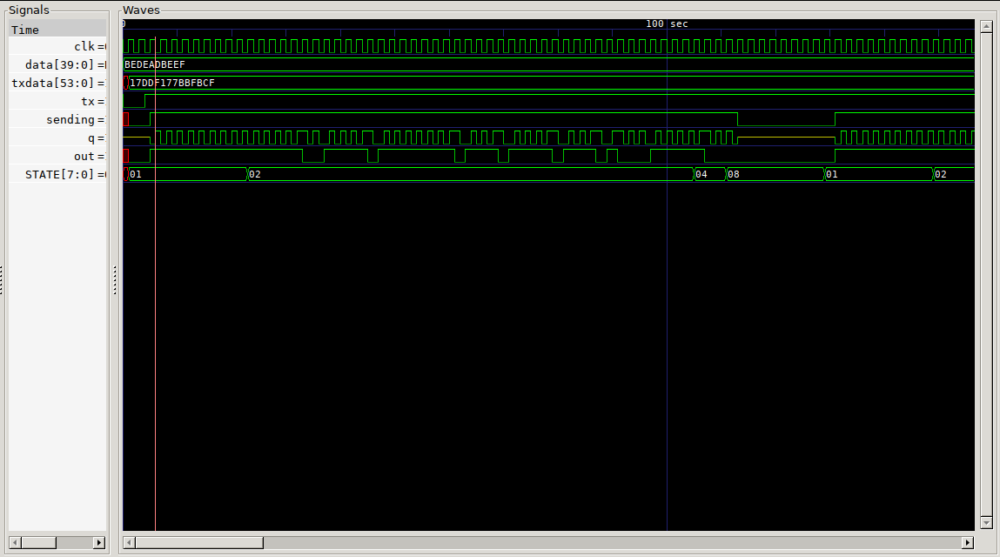

# RFID - Using EM4100 - UNTESTED

EM4100 type tag which are the 125KHz tags using Manchester encoding, output pin should be connected to the tunable load (a 125KHz tuned LC circuit basically).

## Pin

* Input clk
* Input data [7:1] VERSION + [31:0] DATA
* Input tx
* Output q

## Packet

* Header <9bits of 1>
* ID 1-2 <4bits data + even parity>
* DATA 1-8 <4 bits data + even parity>
* Column parity 4 bits even parity of column
* 1 stop bit 0

| 1 | 1 | 1 | 1 | 1   | 1   | 1   | 1   | 1    |
|---|---|---|---|-----|-----|-----|-----|------|
|   |   |   |   | ID1 | ID2 | ID3 | ID4 | RP1  |
|   |   |   |   | ID5 | ID6 | ID7 | ID8 | RP2  |
|   |   |   |   | D1  | D2  | D3  | D4  | RP3  |
|   |   |   |   | D5  | D6  | D7  | D8  | RP4  |
|   |   |   |   | D9  | D10 | D11 | D12 | RP5  |
|   |   |   |   | D13 | D14 | D15 | D16 | RP6  |
|   |   |   |   | D17 | D18 | D19 | D20 | RP7  |
|   |   |   |   | D21 | D22 | D23 | D24 | RP8  |
|   |   |   |   | D25 | D26 | D27 | D28 | RP9  |
|   |   |   |   | D29 | D30 | D31 | D32 | RP10 |
|   |   |   |   | CP1 | CP2 | CP3 | CP4 | 0    |

## Manchest encoding

The data stream is xor'd with a clock running at twice the frequency as the baud.

## Even parity

Simply the xor bitwise sum of the data