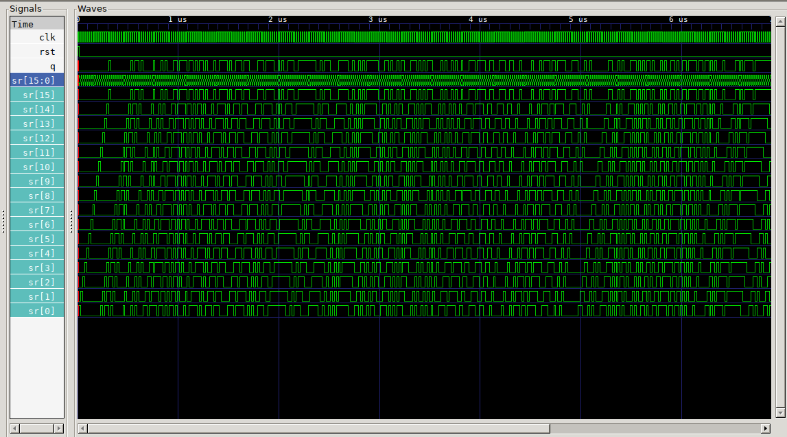

# Linear Feedback Shift Register

Simple Fibonnaci LFSR using polynomial x^16 + x^14 + x^13 + x^11 + 1 as shown [here](https://en.wikipedia.org/wiki/Linear-feedback_shift_register#Fibonacci_LFSRs).

## Pins

* Input clk
* Input rst
* Output q

## Usage

Use `rst` before use to ensure it's not trapped in a zero state.

