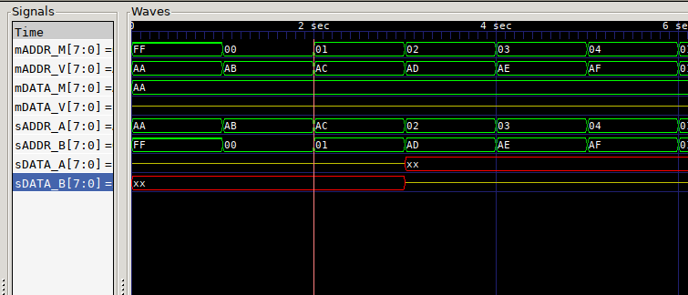

# MEMMUX

Multiplexer for dual VRAM setups. Read from one VRAM while writing to another. I have not yet tested this on hardware. Should work with any two memory blocks. You need to manage OE/WR and CS signals as needed yourself since it'll be a simple matter of connecting `switch`. It wouldn't be hard to add but would clutter the module.



## Pins

Parameterized bus width

Uses master/slave terminology, with master chips being the ones supplying the addresses.

### Master

Connections to MCU/Video device, M connections to upstream MCU, V connects to downstream video device

* mADDR_M - input address bus
* mDATA_M - input data bus
* switch  - Flips the VRAM should be during Vblank for glitchless
* mADDR_V - input address bus
* mDATA_V - output data bus

### Slave

Connections to VRAM chips

* sADDR_A - output address bus
* sDATA_A - inout data bus
* sADDR_B - output address bus
* sDATA_B - inout data bus


## Layout
```
                                        ________
                              mDATA_V  |        |
                     ,---------------->| VIDEO  |
                     |        mADDR_V  | DRIVER |
                     |  ,--------------|        |
		     |  |              |________|
 ________           _|__v___            ________
|        | sADDR_A |        | sADDR_B  |        |
| VRAM A |<--------| MEMMUX |--------->| VRAM B |
|        | sDATA_A |        | sDATA_B  |        |
|________|<------->|________|<-------->|________|
                     ^  ^ ^
	             |  | |  mDATA_M     _____
                     |  | `-------------|     |
		     |  |    mADDR_M    |     |
		     |  `---------------| MCU |
		     |       switch     |     |
		     `------------------|_____|
```

## Synthesis

| Yosys output                |    |
|-----------------------------|----|
| Number of wires:            | 10 |
| Number of wire bits:        | 66 |
| Number of public wires:     | 9  |
| Number of public wire bits: | 65 |
| Number of memories:         | 0  |
| Number of memory bits:      | 0  |
| Number of processes:        | 0  |
| Number of cells:            | 41 |
| $_TBUF_                     | 16 |
| SB_LUT4                     | 25 |