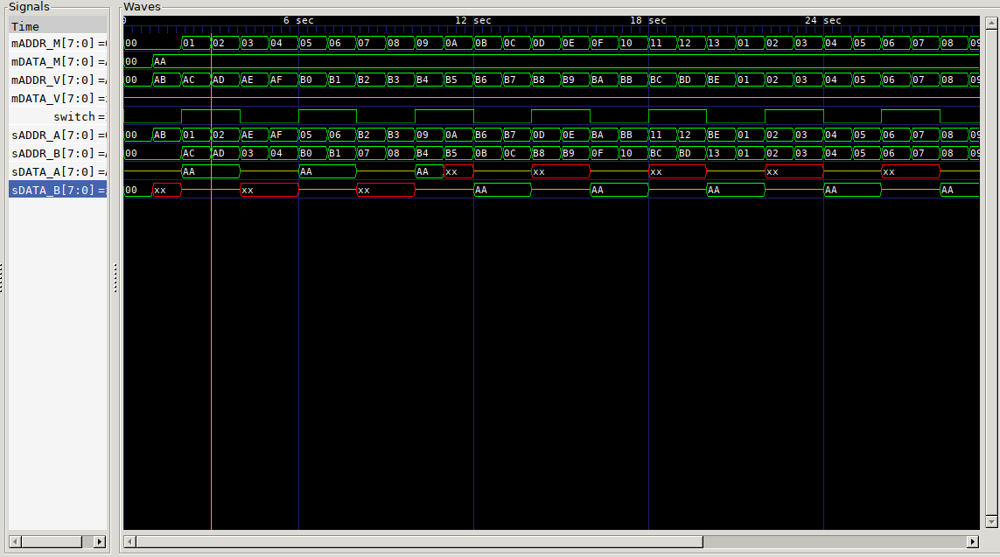

# MEMMUX

Multiplexer for dual VRAM setups. Read from one VRAM while writing to another. I have not yet tested this on hardware. Should work with any two memory blocks. You need to manage OE/WR etc. yourself.



## Pins

Parameterized bus width

Uses master/slave terminology, with master chips being the ones supplying the addresses.

### Master

Connections to MCU/Video device, M connections to upstream MCU, V connects to downstream video device

* mADDR_M - input address bus
* mDATA_M - output data bus
* switch  - Flips the VRAM should be during Vblank for glitchless
* mADDR_V - input address bus
* mDATA_V - input data bus

### Slave

Connections to VRAM chips

* sADDR_A - output address bus
* sDATA_A - inout data bus
* sADDR_B - output address bus
* sDATA_B - inout data bus


## Layout
```
                      mDATA_V   ________
                     ,-------->|        |
                     |mADDR_V  | VIDEO  |
                     |  ,----->|________|
		     |  |
 ________           _|__v___            ________
|        | sADDR_A |        | sADDR_B  |        |
| VRAM A |<--------| MEMMUX |--------->| VRAM B |
|        | sDATA_A |        | sDATA_B  |        |
|________|<------->|________|<-------->|________|
                     ^   ^
	    mADDR_M  |   | mDATA_M
		    _|___v__
		   |        |
		   |  MCU   |
		   |________|
```

## Synthesis

| Yosys output                |    |
|-----------------------------|----|
| Number of wires:            | 10 |
| Number of wire bits:        | 66 |
| Number of public wires:     | 9  |
| Number of public wire bits: | 65 |
| Number of memories:         | 0  |
| Number of memory bits:      | 0  |
| Number of processes:        | 0  |
| Number of cells:            | 41 |
| $_TBUF_                     | 16 |
| SB_LUT4                     | 25 |