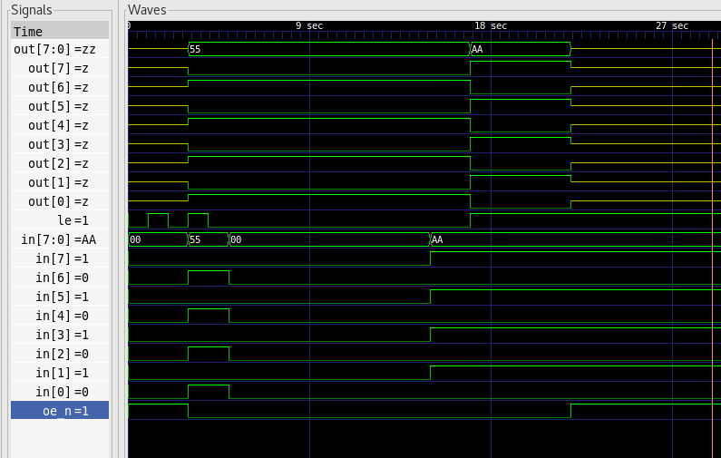

# Parallel latch

Universal parallel in/out latch with output enable.

### Signals

* oe_n - Active low output enable
* le - Active high latch enable
* in - Parallel input
* out - Parallel output

While `oe_n` is high the output is in High Impedence.
If `oe_n` is low and `le` is high then `out` is transparent to `in`.
if `oe_n` is low and `le` is low `out` shows previous `in` value latched at negative edge of `le`.

### Waveform

