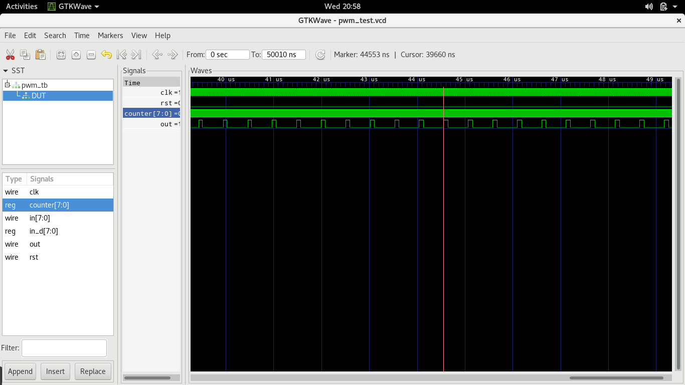

# Pulse with modulator

Classic parallel in pulse width modulator.

* clk - Input clk
* in - Synchronous Parallel input
* rst - Synchronous reset
* out - PWM output.

For full range of duty cycle (0-100%) need `in` to be longer than internal counter.

