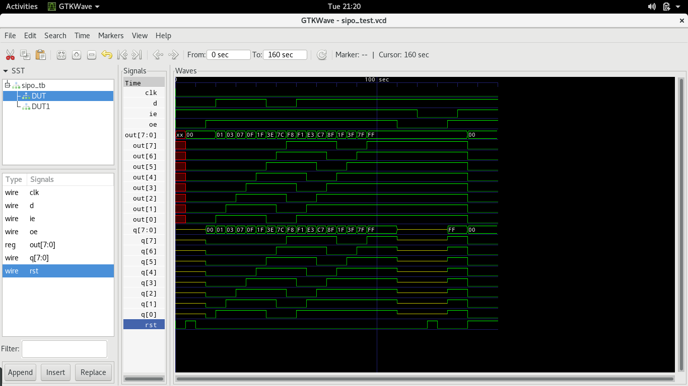

# SIPO

3State Serial in/Parallel out Shift Register.

* clk - Clock in
* d - Serial data in
* dout - Parallel out
* ie - Input Enable
* oe - Output Enable
* rst - Asynchronous reset

## Simulation

