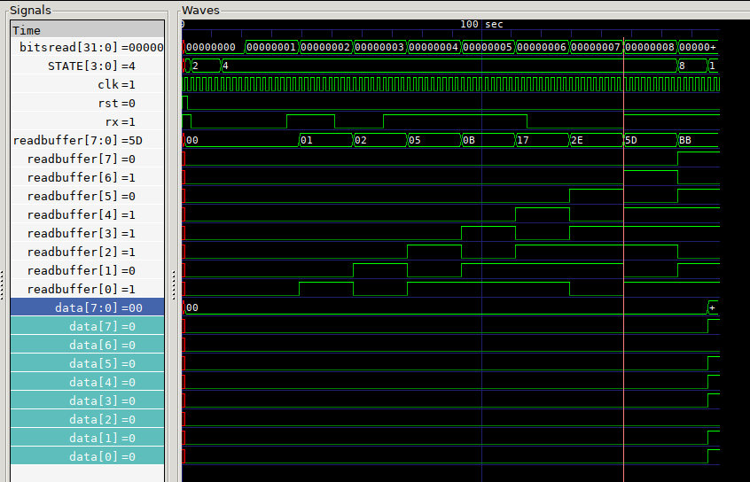
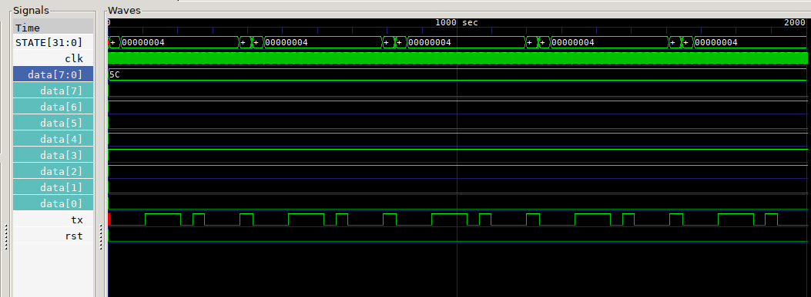

# Universal Asynchronous Reciever/Transmitter (UART) module

Made up of Reciever (RX) and Transmitter (TX) modules, parameterized bitlength.

The module supersamples the RX/TX line at x16 times the clk signal (so for 9600 baud you'd need 16x9600Hz clock).


## Files

```
.
├── README.md			This file
├── UART			iverlog binary
├── UART_RX			iverilog binary
├── UART_RX_tb.v		Testbench for RX module
├── UART_RX.v			RX module
├── UART_RX.vcd			RX testbench output
├── UART_tb.v			Testbench for entire UART module
├── UART_TX			iverlog binary for TX module
├── UART_TX_tb.v		Testbench for TX module
├── UART_TX.v			TX module
├── UART_TX.vcd			TX testbench output
├── UART.vcd			UART testbench output
├── waveform.png		UART waveform
├── waveform_UART_RX.png	RX waveform
└── waveform_UART_TX.png	TX waveform

0 directories, 15 files
```

## UART_RX (Reciever module)

### Pins

* Input clk	Clock signal @ baudrate x 16
* Input rst	Synchronous Reset
* Input rx 	Connected to TX
* Output	[BITS-1:0] data
* Output	data_ready on recieving entire character

### Usage

A clock signal should be provided that is 16 times the baud rate, so for 9600 baud you'd need a clock at 153.6KHz. rst is a synchronous reset. Data is serially shifted in via RX LSB first. Once `BITS` bits are shifted in data_ready is pulled high by the module, until another START condition is detected. It is suitable to be used as in interrupt.

The module avoids spurious START conditions by sampling it 8 times ensuring it stays LOW before begining recieve, and the same for STOP before considering data is valid.

### Simulation



## UART_TX (Transmitter module)

### Pins

* Input clk	Clock signal @ baudrate x 16
* Input rst	Synchronous Reset
* Input		[BITS-1:0] data
* Input		data_ready latch and send
* Output tx 	Connected to RX
* Output data_sent	  Entire character has been sent

### Usage

A clock signal should be provided that is 16 times the baud rate, so for 9600 baud you'd need a clock at 153.6KHz. rst is a synchronous reset. Data is provided in parallel on the data bus, then data_ready is asserted. On the next positive edge of clk it is latched in. Data is pushed LSB first out via TX. Once `BITS` bits are transmitted data_sent will be pulled high by the module until data_ready is pulled up by you. data_sent is suitable to be used as an interrupt.

### Simulation



## TODO

* Add parity support
* Error signal 
