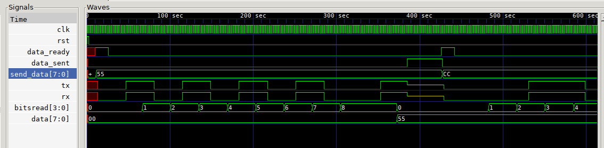

# Universal Asynchronous Reciever/Transmitter (UART) module

Made up of Reciever (RX) and Transmitter (TX) modules, parameterized bitlength.

Needs a clk signal at x16 the baudrate.



## Files

```
.
├── README.md			This file
├── UART			iverlog binary
├── UART_RX			iverilog binary
├── UART_RX_tb.v		Testbench for RX module
├── UART_RX.v			RX module
├── UART_RX.vcd			RX testbench output
├── UART_tb.v			Testbench for entire UART module
├── UART_TX			iverlog binary for TX module
├── UART_TX_tb.v		Testbench for TX module
├── UART_TX.v			TX module
├── UART_TX.vcd			TX testbench output
├── UART.vcd			UART testbench output
├── waveform.png		UART waveform
├── waveform_UART_RX.png	RX waveform
└── waveform_UART_TX.png	TX waveform

0 directories, 15 files
```

## UART_RX (Reciever module)

### Pins

* Input clk	Clock signal @ baudrate x 16
* Input rst	Synchronous Reset
* Input rx 	Connected to TX
* Output	[BITS-1:0] data
* Output	data_ready on recieving entire character

### Simulation


## UART_TX (Transmitter module)

### Pins

* Input clk	Clock signal @ baudrate x 16
* Input rst	Synchronous Reset
* Input		[BITS-1:0] data
* Input		data_ready latch and send
* Output tx 	Connected to RX
* Output data_sent	  Entire character has been sent

### Simulation


