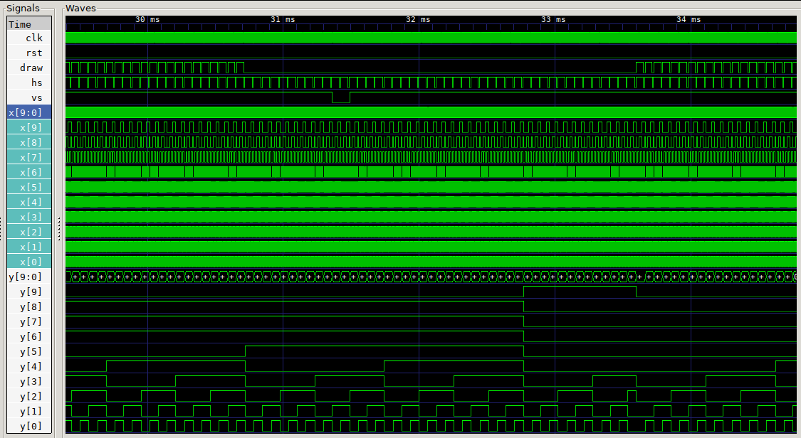

# VGA

Generate a 640x480 59.94Hz VGA signal. Then draw low (outside draw area) RGB out should be in high impedience. X and Y provided for framebuffer usage Y * 640 + X is offset.

Draw area is in top right of the signal the rest is back/front porch to do house keeping.

* clk - Input clk 25.175MHz (25 will do).
* rst - Reset Synchronous
* draw - Draw area active high.
* hs - Horizontal Sync
* vs - Vertical Sync
* x - X pixel co-ordinate Left to Right
* y - Y pixel co-ordinate Top to Bottom

### Horizontal timings

In pixels

* Front porch 16
* Sync 96
* Back porch 48
* Draw 640

### Vertical timings

In lines

* Front porch 10
* Synch 2
* Back porch 33
* Draw area 480

### Simulation output



Output looks good, the code was working with my TV before I cleaned it up but I have made some changes since a actual test.

### Usage

```
$ iverilog -Wall -o vga vga.v vga_tb.v
$ vvp vga
% gtkwave vga.vcd &
```
