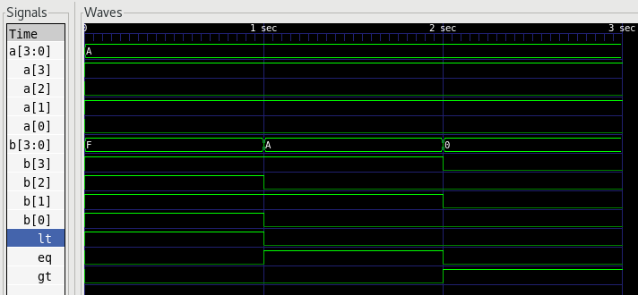

# Digital Comparitor

Asynchronous digital comparitor with greater, equal and lesser outputs.

### Signals

* a - Input A
* b - Input B
* gt - Active high A > B
* eq - Active high A == B
* lt - Active high A < B

### Waveform

